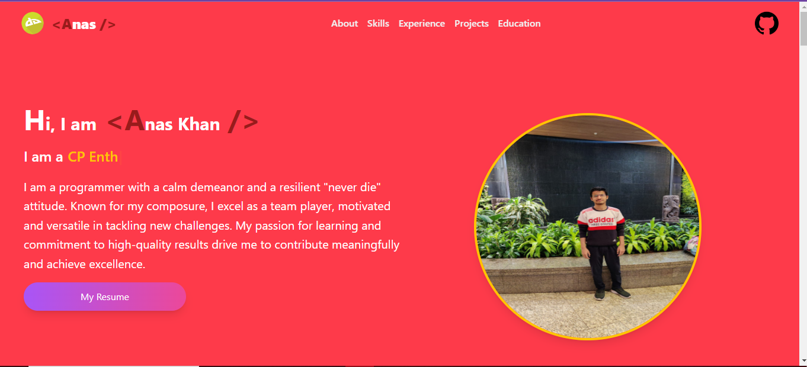
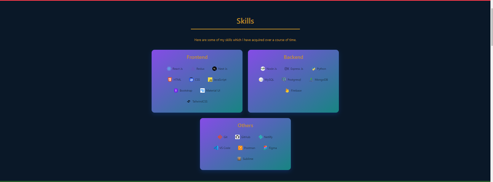
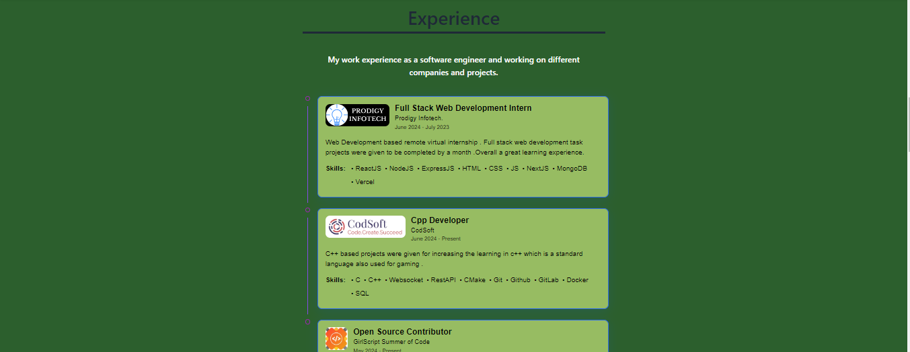
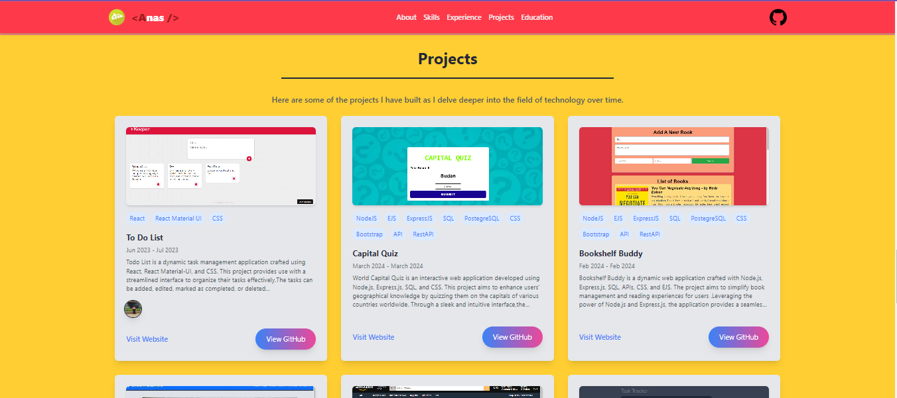
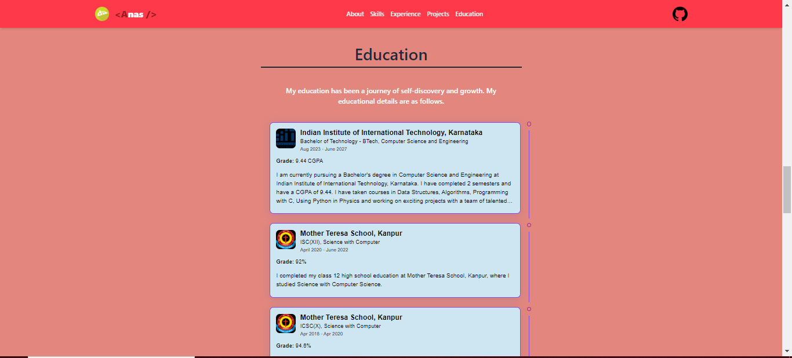
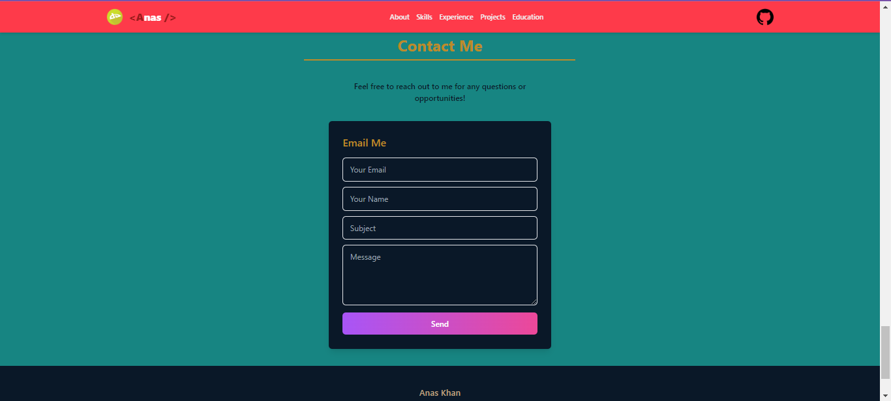
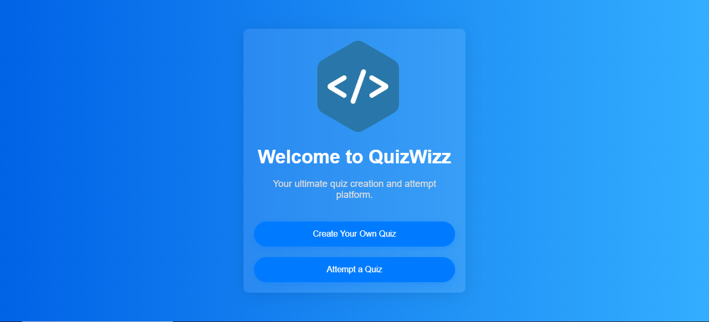
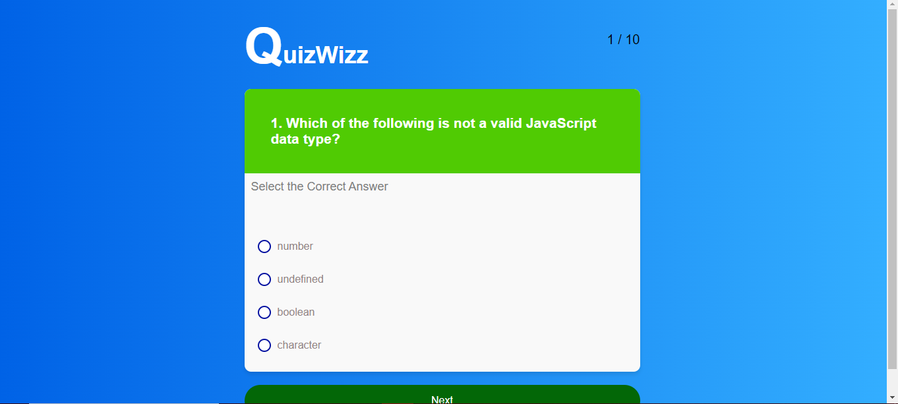
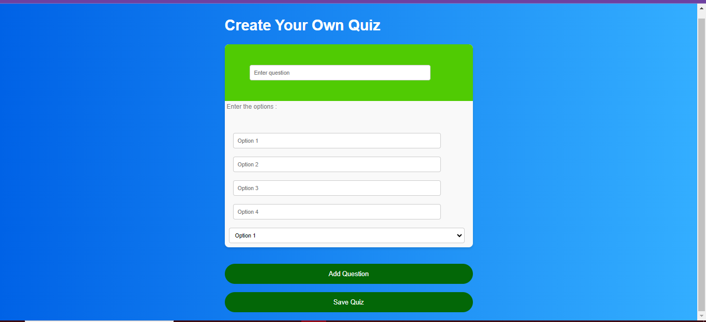
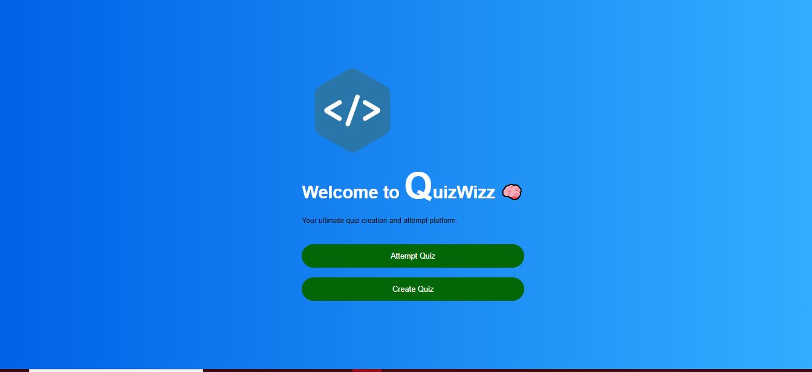

<body>

  <h1><b>AspireNex Projects</b></h1>

  

    <h2><b>1. Portfolio Website</b></h2>
         
    

    
View the project Live - 

    <a class="live-project" href="https://react-portfolio-t0b3.onrender.com/"><b>View Live 🚀<b></a>
      

    <h3>Technologies Used:</h3>
    <ul>
      <li>ReactJS</li>
      <li>CSS</li>
      <li>Tailwind</li>
      <li>Styled Components</li>
      <li>Material Icons</li>
    </ul>
    <h3>Description:</h3>
    

      This project showcases my personal portfolio website built using ReactJS. It includes sections for showcasing projects, skills, and contact information.
    

    <h3>Some Photos:</h3>
    
    
    
    
    
    
     
    
  

       
  

  

    <h2><b>2. QuizWizz</b></h2>
    <h3>Technologies Used:</h3>
    <ul>
      <li>ReactJS</li>
      <li>CSS</li>
      <li>Tailwind</li>
    </ul>
    <h3>Description:</h3>
    

      QuizWizz is a web application built with ReactJS aimed at providing interactive quizzes on various topics. Users can not only create their own quizzes but also answer questions and receive instant feedback on their performance.
    

    <h3>Some Photos:</h3>
    
    
    
    
     
     
     
    

    <a class="live-project" href="https://quizwizz-lay1d5n3w-anas727189s-projects.vercel.app/"><b>View Live 🚀<b></a>
  

   

</body>
</html>

